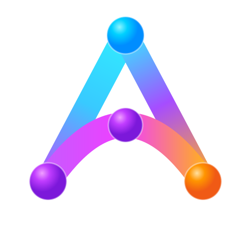

<p align="center">
  
</p>

<h1 align="center">AnaxiGraph</h1>

<p align="center">
  <strong>Understand the system. Guide the agent. Keep the architecture coherent.</strong><br />
  Shared architecture intelligence for people and AI coding agents.
</p>

<p align="center">
  <a href="https://github.com/hcekne/anaxigraph/actions/workflows/ci.yml"></a>
  <a href="LICENSE"></a>
  
  
</p>

<p align="center">
  <a href="docs/onboarding.md">Get started</a> ·
  <a href="docs/agent-plugin.md">Agent plugin</a> ·
  <a href="docs/docker.md">Docker</a> ·
  <a href="docs/advanced-operations.md">Advanced</a> ·
  <a href="CONTRIBUTING.md">Contribute</a>
</p>

AI makes it easy to add code faster than a team can understand the architecture absorbing it.
Hidden coupling, duplicated responsibilities, inconsistent abstractions, and one-off agent changes
quietly become spaghetti code.

AnaxiGraph is the shared architecture intelligence layer for humans and AI agents. It turns a
repository and its Git history into a living model of what the software does, how its parts work
together, why they exist, and how the design is changing. A person can explore that model in the
dashboard; a coding agent can use the same evidence through AnaxiMCP before and after it edits code.

| Promise | For a person | For a coding agent |
|---|---|---|
| 🕸️ **Understand the system** | Move from product responsibilities and architecture areas to subsystems, files, named code parts, dependencies, and history. | Reuse a current repository-wide memory instead of rediscovering the architecture in every session. |
| 🧭 **Guide the agent** | See where a change belongs, what already exists, which patterns may fit, and what could be affected. | Receive a bounded working set, extension points, constraints, relevant tests, evidence, and counter-evidence. |
| 🧹 **Keep the architecture coherent** | Catch growing modules, repeated responsibilities, boundary erosion, cycles, and possible dead code before they harden into the design. | Rescan and compare the same goal after a change instead of treating passing tests as proof of good architecture. |

AnaxiGraph does not hand out a magic architecture score and does not edit the analyzed repository.
It keeps facts read from code, AI-created interpretations, and recommendations distinct so that
beginners can read a plain-language conclusion and experts can inspect the evidence behind it.

## 🚀 Start in four steps

You need Git, Python 3.11+, and [`uv`](https://docs.astral.sh/uv/).

### 1. Run one command in the repository

```bash
cd /path/to/your/repository
uvx anaxigraph up . --open --semantic agent --connect codex
```

Use `--connect claude` for Claude Code. Omit `--semantic agent --connect codex` when you only want
the code-only map.

This command creates or loads repository policy, stores AnaxiIndex outside the target, completes
the current scan, starts the loopback dashboard and AnaxiMCP, and builds representative Git history
in the background. Stop it with Ctrl-C; restart with the same command.

### 2. Open the dashboard

Visit <http://127.0.0.1:8765>. Current architecture is ready before background history finishes.

### 3. Restart Codex in the repository

The explicit `--connect codex` option configures `http://127.0.0.1:8765/mcp` on the machine where
Codex runs. Restart it after first-time setup:

```bash
cd /path/to/your/repository
codex
```

### 4. Ask it to build the AI-created code map

> Use AnaxiGraph to build or resume the AI-created code map for this repository, using your own
> model context and tokens. Start the background coding-agent worker, do not edit source while
> mapping, and monitor it until the status says the map is up to date.

The durable command survives the invoking Codex session:

```bash
anaxigraph understand . --executor codex --background
anaxigraph semantic-status .
```

With `semantic.provider: agent`, `understand` auto-detects an invoking Codex or Claude session and
uses that authenticated local CLI as a read-only semantic executor. Use `--executor codex` or
`--executor claude` to select one explicitly. Use `--executor mcp` when the already-connected agent
should perform the MCP work loop itself; that mode returns `status: agent_action_required`—meaning
the agent still has work to do—until it has submitted every task. `--background` includes the
complete saved task list,
records a durable run handoff in user state, and keeps the host worker alive if the coding-agent
session exits. `semantic-status` reports whether that worker is really running, where its log is,
whether it finished, which saved index it is using, and its model and reasoning effort. The command
deliberately omits a model so the executor can
use its currently supported configured default. Only pass `--model` or `--reasoning-effort` (both
Codex and Claude accept them) for an explicit runtime choice; changing either never makes an
existing AI description stale. Direct MCP
looping handles one limited task at a time when no authenticated host worker is available; it is
not the default way to build the complete map.

When the loopback dashboard is already running, `understand` matches the checkout to its service by
Git remote identity and executes against that sidecar's AnaxiIndex—even when the container sees the
checkout at `/repo`. It never creates a second default database in that case. Without a matching
service it uses the same stable per-checkout user-state path as `anaxigraph up`; a timeout or
invalid inventory fails closed instead of silently choosing another index. `--db` explicitly
selects a standalone index, and `--service-url` explicitly selects a service. Every command result
reports the chosen `index.authority` and physical/service identity for unambiguous handoff.

That is the key cost model: **the connected coding agent does the reasoning with its own tokens**.
AnaxiGraph needs no model key in `provider: agent` mode. It gives the agent a limited page of
evidence for one file or code area at a time, checks the returned structured description, records
which worker and model created it, and resumes unfinished work in a later session. Once every file
has a current description, the same workflow automatically proposes a
responsibility-based area/subsystem map, runs independent AI critic/revision passes, and applies
exact membership and size checks in code. It then produces a versioned **Living Architecture
Charter**: purpose, actors, observable capabilities, responsibilities, important flows, public
contracts, invariants, extension points, patterns, coherence concerns, conflicts, unknowns, and a
behavior-only Capability Brief for fresh-context review. There is no human approval gate: the
result is versioned map metadata and never edits or controls the analyzed code. Unchanged
fingerprints avoid rereading unchanged files or rebuilding unchanged higher-level understanding.
Read the same Charter in Overview, `anaxigraph charter .`, or `ANAXIGRAPH_OVERVIEW`; use the Map
selector or the responsibility map embedded in `ANAXIGRAPH_OVERVIEW` for its area/subsystem structure.

A deterministic scan exposes an honest provisional Charter immediately. AI synthesis replaces it
only when current evidence is complete; a prior Charter is labeled stale after relevant evidence
changes. Optional declared context can clarify an inferred claim without overwriting it:

```bash
anaxigraph charter . \
  --correct-section purpose \
  --statement "Help teams keep AI-assisted code architecturally coherent." \
  --author "repository owner" \
  --rationale "This intended outcome is not fully visible in source structure."
```

The overlay retains the inferred statement, author, time, and rationale in AnaxiIndex. Repeat with
`--withdraw` to remove it from the current presentation. Human input is never required for Charter
generation, refresh, or agent use.

The complete [onboarding guide](docs/onboarding.md) explains the normal coding loop and setup
diagnostics.

The installed AnaxiGraph skill carries the normal coding loop. The dashboard's `/api/glossary`
response exposes the same finding-state and measurement meanings for clients that render the
human interface; they are not duplicated as another agent tool.

## 🔁 Use one coding loop

Keep one persistent AnaxiGraph service running throughout the coding session. The service supervises
its structural watcher internally, so ordinary saves update cheap structural facts without a second
container or another model-backed repository pass. Build the complete AI map once when needed.

Give the connected agent one concrete goal. `ANAXIGRAPH_GUIDE` is the front door: use
`intent="understand"` for the system map, `build` for placement, `improve` for a bounded structural
change, `redesign` for the capability-first fresh-eyes review, and `reassess` after editing.

> Use AnaxiGraph to guide “add saved prompt exports.” Find the smallest relevant file set, tell me
> where the code belongs, inspect what depends on shared files, identify the focused checks, and
> refresh the shared map after implementation.

The agent follows one sequence:

1. **Guide** — `ANAXIGRAPH_GUIDE(intent="build"|"improve")` returns one evidence-backed
   recommendation, likely files, placement, counter-reasons, bounded impact, tests, and risks.
2. **Impact** — `ANAXIGRAPH_IMPACT` shows direct dependants of the shared files before they change.
3. **Change** — edit source and run focused tests through the normal coding workflow. AnaxiGraph
   observes the repository; it does not edit it.
4. **Refresh and reassess** — request `ANAXIGRAPH_SCAN(refresh_semantics=true)`, finish any prepared
   AI work, then call `ANAXIGRAPH_GUIDE(intent="reassess")`. The scan compares code fingerprints,
   reuses unchanged file meanings, and prepares only structurally changed files plus context whose
   interfaces or relationships changed. The shared before/after response explains observed changes,
   architectural consequences, possible improvements or regressions, reasons to leave the design
   alone, and the smallest safe verification step. It creates no approval or change-management
   state. The same result is visible under **Changes** or from `anaxigraph reassess .`.
   Use History when you need the wider introduction, recurrence, churn, or co-change context.

With the default `semantic.refresh: on_scan`, an explicit scan prepares those changed and affected
scopes automatically. `anaxigraph update . --prepare-semantics` is the explicit equivalent for a
repository that keeps manual refresh. Run `anaxigraph understand . --executor codex --background`
to execute the prepared work. Static reassessment is available immediately; ask again after
`semantically_ready` when the decision needs refreshed responsibility, duplication, pattern, or
possible-unused-code evidence.

The reviewed responsibility map has its own incremental validation boundary. It is carried forward
when the included file inventory and map policy still match and the fraction of unchanged intrinsic
module roles meets `semantic.taxonomy.stability_bias` (default `0.8`). New or removed files, changed
map constraints, or broader responsibility drift trigger a fresh proposal and its configured agent
reviews. A carried taxonomy does not suppress affected context, group, repository, or pattern work.
Planning responses expose this decision and the currently queued cascade under `work_plan`.

Each guidance and impact reply includes server time, payload size, and model-token use. Semantic
status groups AI jobs by action with current-snapshot and lifetime time/token totals, while scan
results and detached execution records show wall-clock duration. Successful and failed attempts
contribute token totals when the executor reports them. A process killed before it emits usage is
still labeled unreported; zero is never presented as proof that the model call was free.

A changed metric or finding is not automatically an improvement. Expected behavior, focused tests,
and architecture evidence must agree. The [onboarding guide](docs/onboarding.md#use-one-coding-loop)
explains the same loop; lower-level and operator workflows stay in the
[advanced guide](docs/advanced-operations.md).

## 👀 Challenge the design with fresh eyes

For a major refactor, AnaxiGraph can deliberately step outside the current package layout instead
of asking an agent already immersed in the repository to redesign what it just read. Start the
fixed review explicitly:

```bash
anaxigraph fresh-eyes . --start --proposals 2
anaxigraph understand . --executor codex --background
anaxigraph fresh-eyes .
```

The clean-sheet agents receive only the behavior-only Capability Brief and external constraints—no
current paths, frameworks, findings, history, or architecture map. A blind adjudicator preserves
meaningful disagreement, then a repository-aware pass compares that reference design with what is
actually built. A final mission filter keeps only small, justified recommendations and records
reasons not to proceed. One proposal is the lower-cost mode, two is the recommended default, and
three is optional.

The connected Codex or Claude executor supplies the model context and tokens; AnaxiGraph supplies
bounded evidence, validates each result, and resumes the saved stages after interruption. The
dashboard exposes the same review under **Improve → Fresh eyes**. A connected agent can read or
start it through `ANAXIGRAPH_GUIDE(intent="redesign", start=true, proposal_count=2)`. The older
`fresh_eyes=true` form remains accepted. Starting a
review never edits source or automatically accepts a recommendation.

Changing executor, model, or reasoning effort does not silently invalidate a completed review.
When you deliberately want a new architectural judgment, run `anaxigraph fresh-eyes . --restart`
(a connected agent requests the same rerun with
`ANAXIGRAPH_GUIDE(intent="redesign", start=true, restart=true)`) and then run
`anaxigraph understand` with your explicit runtime model and reasoning-effort choices.
The new generation reruns every Fresh-Eyes stage while preserving the earlier documents for audit;
it does not force unchanged module dossiers to be regenerated.

Every review lists the generations it has recorded, with the executor models, stage timings, output
volume, token counts, and attempts of each. Read an earlier one in full with
`anaxigraph fresh-eyes . --generation 2`, `GET /api/fresh-eyes?generation=2`,
`ANAXIGRAPH_GUIDE(intent="redesign", generation=2)`, or the generation selector in
**Improve → Fresh eyes**. A recorded generation is history: it reports `superseded` and cannot be
started, retried, or restarted.

## 🐳 Durable Docker sidecar

If you prefer an isolated, persistent container beside the repository:

```bash
cd /path/to/your/repository
uvx anaxigraph init . --start --semantic agent --connect codex
```

The generated Compose service mounts source read-only, drops Linux capabilities, enables
no-new-privileges, persists AnaxiIndex in a named volume, and publishes only to loopback by
default. Use `--connect claude` for Claude Code. Preview the full repository and client change with
`--dry-run --json`.

See [Docker operation](docs/docker.md) for manual Compose review, updates, watchers, and the
experimental multi-repository registry.

## 🔌 Install the guided agent workflow

The shared plugin teaches Codex and Claude Code how to select the right indexed repository, build
or resume the AI-created code map, find a small set of likely files and affected callers, hand off
a planned finding, and verify a completed change.

Codex:

```bash
codex plugin marketplace add hcekne/anaxigraph && \
  codex plugin add anaxigraph@anaxigraph
```

Invoke `$anaxigraph`. Claude Code:

```bash
claude plugin marketplace add hcekne/anaxigraph && \
  claude plugin install anaxigraph@anaxigraph --scope user
```

Invoke `/anaxigraph:anaxigraph`. The plugin includes the default loopback MCP connection, so
plugin users may omit `--connect` from the start command. See the
[agent plugin guide](docs/agent-plugin.md) for the safety contract and custom endpoint behavior.

## How it works

```text
source + Git ── facts, hashes, relationships, history ──→ versioned AnaxiIndex
                                                               │
                                  ┌────────────────────────────┴──────────────────────┐
                                  ▼                                                   ▼
                         human dashboard                                      AnaxiMCP for agents
                    understand and investigate                         plan, inspect impact, verify
                                  │                                                   │
                                  └────────────────────┬──────────────────────────────┘
                                                       ▼
                                             better shared decisions

changed or stale modules ── bounded evidence ──→ connected agent using its own tokens
                                                       │
                                                       └──→ checked descriptions in AnaxiIndex
```

Structural refresh and semantic execution are separate operations. A dashboard **Refresh scan**
runs asynchronously with observable progress and safe cancellation; semantic prepare/resume uses
the already-current snapshot and never hides a structural rescan inside the command.

Three named surfaces share one index:

- **AnaxiGraph** is the scanner, dashboard, and overall project.
- **AnaxiIndex** is the SQLite record of repositories, files, named code parts, direct code links,
  findings, history, and AI-created descriptions.
- **AnaxiMCP** gives coding agents size-limited repository evidence and controlled ways to update
  the external index.

AnaxiGraph does not execute target code and does not edit repository source. A generated sidecar
mounts the target read-only. The target needs only optional `.anaxigraph.yml` policy; analysis
state stays external.

### Facts are not opinions

AnaxiGraph deliberately separates:

1. **facts read directly from repository data**—hashes, code structure, named code parts, direct
   links, Git changes, branch counts, imported test coverage, and which analyzer produced them;
2. **AI explanations**—purpose, responsibilities, role in the repository, related behavior, and
   pattern opportunities, each with the model, instructions, evidence, and evidence-strength
   rating that produced it; and
3. **recommendations**—reviewable proposals with evidence, counter-evidence, cost, safety, and
   lifecycle state.

Relationship edges say whether they are resolved, ambiguous, unresolved, or external. Dynamic
runtime wiring can still be invisible, so a missing edge is never presented as proof of dead code.

### One index, several views

The map selector distinguishes four sources instead of blending them: **Current view** uses
optional declared intent first, then the AI-reviewed **Responsibility map**, then the deterministic
**Path map** fallback; **Declared map** shows repository policy alone. Stable group identities are
kept separate from their display labels, and history uses today's current-view frame by default so
the same regions visibly fill and connect over time.

- **Understand** combines the Living Architecture Charter, overview, file inventory, and graph.
- **Guide** answers where to build and how to refactor with the same recommendation for a person or
  coding agent.
- **Improve** combines the ranked finding record and reviewed pattern intelligence.
- **Changes** replays representative first-parent commits and supports reassessment after edits.
- **Settings** owns repositories, readiness, refresh, and progressively disclosed operations.
- **Pattern intelligence** also exposes finalized evaluations through `anaxigraph patterns` and the
  paged `/api/patterns` endpoint. Guidance includes relevant recommendations directly for coding
  agents. Each result leads with a conclusion, evidence, action, cautions, and
  verification; its nine exact ratings are grouped and explained instead of shown as a number wall.
  Candidate results likewise explain why a pair was selected or skipped, what evidence is missing,
  and why the internal selection order is not itself a pattern recommendation.

`anaxigraph search "goal or code name" .` uses the same bounded SQLite FTS ranking as dashboard
search, `ANAXIGRAPH_SEARCH`, and the first step of architecture guidance. It searches paths, filenames,
symbols, summaries, responsibilities, contracts, and normalized aliases, then reports the semantic
provenance that contributed to each result.

## 🎯 Findings are a workflow, not a wall

The default attention list shows at most 20 useful findings and excludes routine long-function
notes. The complete record remains filterable and paginated; no evidence is deleted merely to
quiet the UI.

Every finding says what AnaxiGraph saw, why it may matter, what to do, when the code may be fine as
it is, and how to check the result. The dashboard, REST API, MCP tools, guidance results, and copied
agent prompt use the same wording. Exact rule IDs, evidence values, and ordering scores remain
structured fields for automation, but each field has an adjacent ordinary-language meaning; they
are never dumped into a jargon-filled “technical details” section. **Plan agent work** selects
a finding for implementation; its handoff also says which retained code map first shows the
problem, where it disappears, and whether it later returns. Resolution and regression normally
come from a later scan. Retained maps are samples, so the named frame bounds the change rather than
claiming that every Git commit was analyzed.

## Current support boundary

Python uses its built-in AST. JavaScript, JSX, TypeScript, and TSX use pinned Tree-sitter grammars
for structural symbols, imports and re-exports, CommonJS, modern dynamic imports, source spans,
TypeScript declarations, and syntax-level type evidence. Workspace targets resolve from indexed
`package.json`, `tsconfig.json`, and `jsconfig.json` evidence with explicit provenance and honest
ambiguity; AnaxiGraph does not run the target build or pretend it has compiler/type-checker or
runtime certainty. Other recognized source and text formats have heuristic or inventory support.
The roadmap deliberately does not call extension recognition “full language support.” See the
[capability matrix](docs/language-support.md).

Linux x86-64 is release-gated. Linux ARM64, macOS, and WSL2 are best effort; Docker Desktop is the
recommended macOS path. Native Windows is not supported—use WSL2. See the
[platform matrix](docs/platform-support.md).

The REST and MCP service is a local sidecar. Keep it bound to loopback or access it through a
trusted SSH tunnel; do not expose the port to an untrusted network.

## Advanced operation

The [advanced guide](docs/advanced-operations.md) covers local Codex/Claude/custom executors,
semantic cost and privacy, SSH forwarding, custom ports/state,
optional coverage imports, durable history controls, watchers, integrity diagnostics, upgrades,
resets, lower-level CLI commands, and several repositories.

## 🛠️ Development

```bash
uv sync --extra dev
uv run pre-commit install --install-hooks
uv run python scripts/run_quality_gate.py --base origin/main
```

The quality gate includes a fresh, repeatable AnaxiGraph scan of this repository. Its full report
is retained in CI and compared with
[`quality/self-analysis-baseline.json`](quality/self-analysis-baseline.json); new or worsened
warning/error findings fail while unchanged information-level diagnostics remain visible and
non-blocking. Run it directly with
`uv run python scripts/check_self_analysis.py --output /tmp/anaxigraph-self-analysis.json`.

The product brief is [`repo_instructions.md`](repo_instructions.md), the consecutive roadmap is
[`docs/feature-development-plan.md`](docs/feature-development-plan.md), and the release contract is
[`docs/releasing.md`](docs/releasing.md). Contributions are welcome; see
[`CONTRIBUTING.md`](CONTRIBUTING.md).
